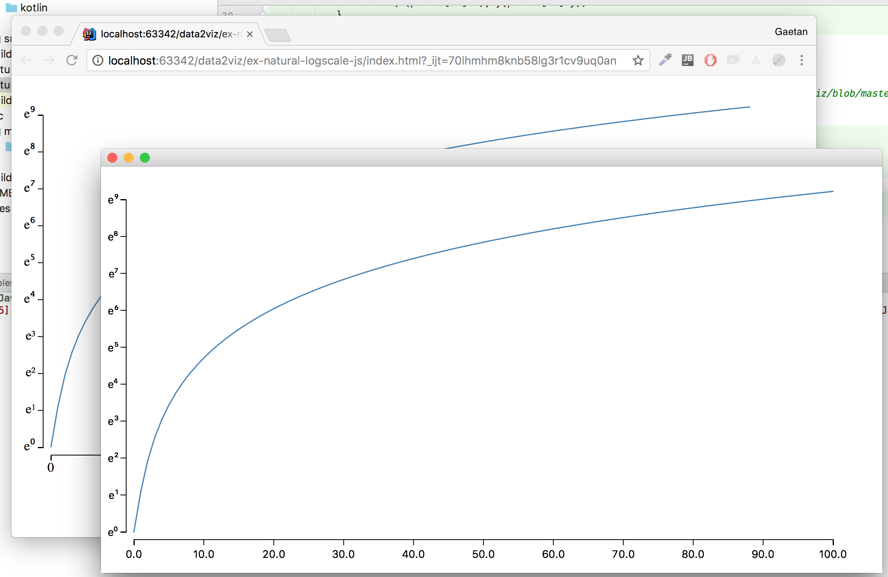
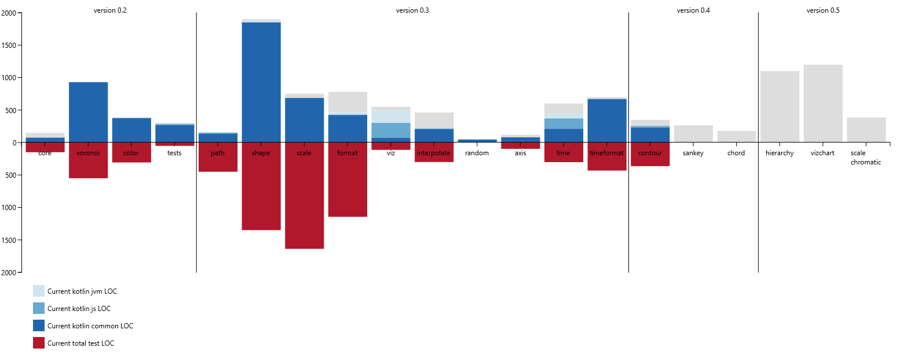

[ ](https://bintray.com/data2viz/data2viz/data2viz/_latestVersion)
[](https://travis-ci.org/data2viz/data2viz)
[](http://www.apache.org/licenses/LICENSE-2.0) 
# Isomorphic dataviz

data2viz is a multiplatform data visualization library based on kotlin. The rendering produces the same result
on each platform.

It is currently possible to use it in the browser (javascript + svg) or in the JVM (bytecode + JavaFx).

The code is separated in modules that can be independently used. Some are specifically designed for visualization 
([d2v-path](https://github.com/data2viz/data2viz/tree/master/path), 
[d2v-shape](https://github.com/data2viz/data2viz/tree/master/shape), 
[d2v-viz](https://github.com/data2viz/data2viz/tree/master/viz)) and others can be used outside of dataviz projects. 
For example, 
[d2v-format](https://github.com/data2viz/data2viz/tree/master/format) 
can be used as a multiplatform kotlin format library outside of any dataviz project.

data2viz proposes to develop data visualizations through a fully typed DSL. It simplifies the creation of complex
 visualizations by helping developer with IDE’s suggestions based on the current context.



### Some DSL samples
The internal DSL allows to create data visualization using hierarchical
code that should be easy to understand.

```kotlin
group {
    transform {
        translate(margin.left, margin.top)
        rotate(20.deg)
    }

    rect {
        width = totalWidth - margin.horizontalMargins
        height = totalHeight - margin.verticalMargins
        fill = rgba(0, 0, 0, .1)
    }
}
```

In that code, `g` adds a new group. The next `{` starts a new block of code that is
applicable in the current context. Inside a group, we can apply a transformation. The
`transform {` code starts a new block of code to define the properties of the transformation.

Having a typed DSL, the IDE proposes accurate suggestions depending on the position of
  the caret. Inside a `transform` block, we can call `translate`, `rotate`, `scale`,
  `skewX`, `skewY`,...

The `rect {` code opens a block for adding a rectangle and configure it. Its width
height, and fill color are defined using an affectation. Again, having a strong DSL
allows to benefit from the IDE assistance to choose the correct values. `fill` is a
property of type `Color`. It can be created from a call on `rgb`, `rgba`, `hsl`, `hsla` functions
 or converted from an hex string. `"#ab1212".col()` or just by referencing a CSS color
 (`steelblue`, `grey`,... ).

In any case, due to the strong typed language used, any error will be notified during the
compilation phase.

<a href="http://data2viz.io/examples/chart/index.html">
 
 <br>a sample with axis, animation, scaling, ...
</a>

### Current status && Roadmap



#### V0.3 80%: 
The main purpose of this version is to propose the multiplatform bootstrap API allowing to build
visualizations in a common module and deploy them indifferently in the browser or as a JavaFx 
application.

The content of the available visual elements is: 
  - basic elements like lines, circle, text, rectangle, ...
  - path and shapes: curves, pie, ...

This version also contains some utility packages:
  - format: to simplify and provide an uniform way of formating numbers in Js and JVM,
  - time and time-format: unified way of managing time for dataviz.

#### V0.4:
Based on the visual elements, components for charting (chord, sankey, hierarchy, ...)

#### V0.5:
First version of a charting API (inspired by vega-lite)

#### V0.6:
selection API (preparing dynamic visualizations)

#### V0.7:
DSL for dynamic visualisations (timer, transition, ease, zoom, drag)

#### V0.8:
Provide the geographic API with some geo projections.

#### V0.9:
Polishing APIs and DSLs.

### Performances

It's difficult subject because a lot of parameter have an influence on the global 
performance of an javascript application: the browser, the type of executed code.

However, this is a example of quite heavy algorithm with a lot of rendering. The
number of points is increased until FPS gets lower than 40. Click on the link to 
test it inside your browser.

<a href="http://data2viz.io/examples/voronoisphere/index.html">
 
 <br>a sample with voronoi, animation.
</a>

### Tests
Tests are executed through karma and mocha and included in the build.

### How can I use it?

Remember: you should not use it in production now.

Artefacts are published on [Bintray](https://bintray.com/data2viz/data2viz/data2viz).

You can have a look on the project [data2viz-examples](https://github.com/data2viz/data2viz-examples) to
see how it is possible to use it.

## Inspirations
d3js, kotlinx.html, kotlintest
