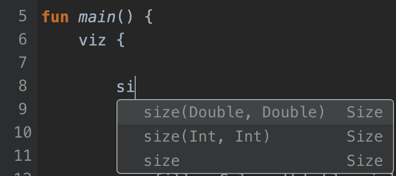
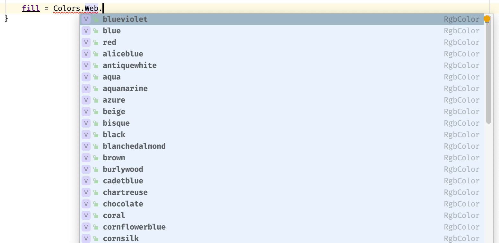

# Data2viz API and DSL principles

One of Data2viz goal is to provide an efficient way of creating 
data visualizations through code. The first base of this 
efficiency is the API and DSLs.

## Discoverable API

They are a few ways to discover an API. 

**The first one is by reading extensive documentation**, 
to have in-depth knowledge on how to precisely write the code. 
This way is mandatory when you are using a dynamic language, 
like _JavaScript_. The IDE can't help during the typing of the code 
because of the dynamic structure of the language that prevents him 
from parsing what you are currently writing. 

On the contrary, when using a statically typed language, 
like _Kotlin_, the IDE can parse the code, and using its precise 
understanding of the context of your position, propose you some 
accurate suggestions: variables to read or write, functions to call, ... 
When you start to use this way of writing code, it becomes a habit: 
you type the name of a variable available in the current context and 
by using the right shortcuts, **you discover the API**.



This way of discovering an API is very productive. You stay in the context of your code, without switching to another tool or application, and access almost instantly to the available valid suggestions. Now, you need to know the basic concepts of your library to be confident about what you are looking for.
 
Data2viz tries to promote this way of coding. When we can, we give access to code variant using a first pointer which will guide you.

For example, if you need to set the fill color of a circle, inside the context of your circle, you can start to type:

```kotlin
fill = Colors.
```

You will then have few proposals:


All these functions are constructors for Colors using different 
color spaces: hcl,hsl, lab, lch, rgb, etc. The IDE is proposing this code
because it is valid code for fill variable affectation.

But, from there, you can also add: 

```kotlin
fill = Colors.Web.
```

You then access to all existing Web colors: 

