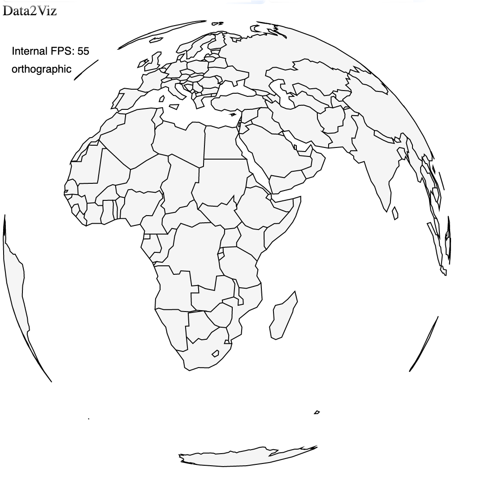

# Geo module

Data2viz `io.data2viz.geo` module goal is to provide tools to facilitate map projections: transformation of the latitudes and longitudes of locations from the surface of a sphere into locations on a plane.

The module provide the basics projections: orthographic, ...

The API is designed to allow the addition of new projections.

## Projector & Projections 

Projection is the class (interface?) used to configure the projection. ...

Projector is ...


## How to use

To display `GeoJsonObject` with given `Projection` you can use next class

```
open class GeoPathNode(
    var geoData: GeoJsonObject? = null,
    var geoProjection: Projection = identityProjection(),
    path: PathGeom = PathGeom()
): PathNode(path) {


    fun redrawPath() {
        val geoPath = geoPath(geoProjection, path)
        clearPath()
        geoPath.path(geoData!!)
    }
}

viz {
	val geoPathNode = GeoPathNode().apply {
        stroke = Colors.Web.black
        strokeWidth = 1.0
        fill = Colors.Web.whitesmoke
        geoProjection = orthographicProjection()
        geoData = geoJsonObject
        redrawPath()
    }
}
```




## Projector & Projections

`Projector` is class which have only two functions:

* project
* invert project

To display projection you use both: `Projector` and `Projection`. Base `Projection` is `ProjectorProjection`

```
fun orthographicProjection() =
    ProjectorProjection(OrthographicProjector()) {
     
    }
```

`Projection` support base transform operations:

* `scale`
* `translate`
* `rotate`
* `precision`

## Clipping

### Angle
### Extent

### Fit

## Geojson support

## New projection

To implement new projection you should extend `Projector`
For example `orthographic`
 
```
 class OrthographicProjector : NoCommonCalculationsProjector {
    override fun projectLambda(lambda: Double, phi: Double): Double = cos(phi) * sin(lambda)

    override fun projectPhi(lambda: Double, phi: Double): Double = sin(phi)


    override fun invertLambda(lambda: Double, phi: Double): Double {
        return azimuthalInvertLambda(::asin)(lambda, phi)
    }

    override fun invertPhi(lambda: Double, phi: Double): Double {
        return azimuthalInvertPhi(::asin)(lambda, phi)
    }
}
```

and use it with base `ProjectorProjection`

## Composed projections

You can combine diffrent projecitons and projectors, for example `AlbersUSAProjection`


## More projections

d2v API is similar to d3-geo, so you can easily port projections from [d3-geo-projections](https://github.com/d3/d3-geo-projection)

## Performance

More information about several functions for project point and separated Lambda/Phi  and
