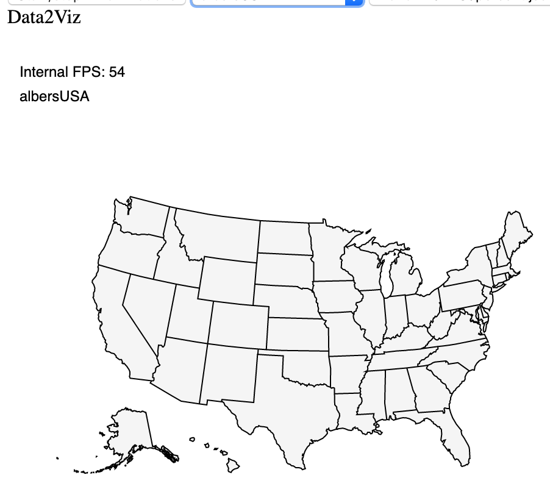

# Date2Viz geo

Data2viz `io.data2viz.geo` module goal is to provide tools to facilitate map projections: 
the transformation of the latitudes and longitudes of locations from the surface of a sphere into 
locations on a plane. However, projections are not limited to discrete points. To draw maps, we need 
more complex geometries: lines (streets, highways, and boundaries), polygons (countries, provinces, 
tracts of land), and multi-part collections of these types.

The [GeoJson specification](https://tools.ietf.org/html/rfc7946) defines these geometries, 
which are the start of this API. 

`GeoJson   —>   projection   —>   Path`

The module provide the basics projections: orthographic, ...

The API is designed to allow the addition of new projections.

Main interfaces are `Projector` & `Projection`

## Projector

`Projector` represents one transformation. It may be Projection transformation like 
`OrthographicProjector ` or common transformations like `RotationProjector`. There are two methods

* project
* invert (actually should invert project operation)

```
interface Projector {

    fun project(lambda: Double, phi: Double): DoubleArray

    fun invert(lambda: Double, phi: Double): DoubleArray
    
 ...
}

```

Example:


```
 class OrthographicProjector : Projector {
override fun project(lambda: Double, phi: Double): DoubleArray 
    = doubleArrayOf(cos(phi) * sin(lambda), sin(phi))
    

override fun invert(lambda: Double, phi: Double)
	= azimuthalInvert(::asin)(lambda, phi)}    
    ...
    
```

It is not required to implement `invert`, in this case it is better to use `NoInvertProjector` which throws error if somebody will use invert function, when projector doesn't actually support it.

### Composed projectors

It is possible to compose two projectors ino one by `ComposedProjector`. For example it is used in `ProjectorProjection` to combine scale projector, rotate projector and translate projector

### Conditional projectors

Some projections like `ConicConformal` use different projectors for different `lambda` and `phi`. Special `ConditionalProjector` provides API to select nexted projector before `project` and `invert` operations

### Performance

Point project and invert is easy to understand and write, but it is have one big issue: low performance due to a lot of `doubleArray` creation during transformation.

To remove this bottleneck `Projector` have additional methods

```
    fun projectLambda(lambda: Double, phi: Double): Double

    fun projectPhi(lambda: Double, phi: Double): Double
    
    fun invertLambda(lambda: Double, phi: Double): Double

    fun invertPhi(lambda: Double, phi: Double): Double

```

Internal code sometimes use point and sometimes use axys transformations (whatever is best for performance in current state).

Internal Projectors ovverides both all 6 methods (2 for point project/invert and 4 for separated project/invert by axys).

There are `SimpleProjector` which have bad performance but require to override only point project/invert functions

## Projection

`Projection` is container for any `Projector` which provides additional transformations like:

* `scale`
* `translate`
* `rotate`
* `precision`
* `center`

And clipping

* `preClip`
* `postClip`

`Projection` provides `stream` method to apply all transformations and receive `Path` with transformed and clipped original `GeoJSON` object

Base implementation for `Projection` is `ProjectorProjection` which actually add additional transformations to given `Projector`

### Transformations API

Projection supports two ways to add additional transformations - by **point** and by **axys**
For example `Translate` (same for other APIs):

```
var translateX: Double // x axys

var translateY: Double // y axys

fun translate(x: Double, y: Double) // point

```

Point transformation is fast and usually used in internal calculations.
Axys transformations is easy to use in client code, for example when you want to change only one axys


### Clipping API

`Projection` provides `preClip` and `postClip` 

Original d3-geo API contains `angleClip`, `extentClip`, `antimeridianClip`, `noClip` are implemented as extesions, because it is actually special variants for `preClip` and `postClip`

Geo module provides fit clipping extesions, which helps to clip projeciton to given `GeoJsonObject` area:

```
fun Projection.fitExtent(extent: Extent, geo: GeoJsonObject): Projection
fun Projection.fitWidth(width: Double, geo: GeoJsonObject): Projection 
fun Projection.fitHeight(height: Double, geo: GeoJsonObject): Projection 
fun Projection.fitSize(width: Double, height: Double, geo: GeoJsonObject): Projection 
```

Actually, they use `Extent` clipping


## Stream

`Stream` helps convert original geo object (geo module provides extensions for `GeoJSON` objects) with given `Projection` to `Path` which can be used in `viz` 

```
interface Stream {
    fun point(x: Double, y: Double, z: Double) {}
    fun lineStart() {}
    fun lineEnd() {}
    fun polygonStart() {}
    fun polygonEnd() {}
    fun sphere() {}
}
```

Geo module converts geo object (like `GeoJson`) to sequence of Stream API calls, for example:

Given GeoJSON object

```
{
	"type": "Polygon",
	"coordinates": [
		[[0, 0], [0, 1], [1, 1], [1, 0], [0, 0]]
	]
}
```
 Will produce the following series of method calls on the stream:
 
 ```
stream.polygonStart();
stream.lineStart();
stream.point(0, 0);
stream.point(0, 1);
stream.point(1, 1);
stream.point(1, 0);
stream.lineEnd();
stream.polygonEnd();
 ```
 
Usually, `Stream` is Adapter for another `Stream` and make one simple operation like scale, rotate, project, clip or transformAngleToRadians:

```
private val transformRadians: (stream: Stream) -> DelegateStreamAdapter = { stream: Stream ->
    object : DelegateStreamAdapter(stream) {
        override fun point(x: Double, y: Double, z: Double) =
            stream.point(x.toRadians(), y.toRadians(), z.toRadians())
    }
}
```

Actually, `ProjectorPorjection` is sequence of streams:

```
override fun fullCycleStream(stream: Stream): Stream {
        return transformRadians(transformRotate(rotator)(preClip.preClip(resampleProjector(postClip.postClip(stream)))))
    }
```

### Extending Projection

Sometimes, `ProjectorProjection` is extended to add addtional functionality. For example `MercatorProjection` creates new clip functions each time when transformation arguments changes

### Composed projections

You can combine diffrent projecitons and projectors, for example `AlbersUSAProjection` which actually project 3 areas (lower 48 US states, Hawai and Alaska).



### Use Projection in Viz

To convert given `GeoJsonObject` and `Projection` you should:

* create new `GeoPath` with given `Projection` and `Path` from viz `PathNode` via `val geoPath = geoPath(geoProjection, path)`.
* Stream `GeoJsonObject` to created `GeoPath` like `geoPath.path(geoJsonObject)`

### Performance

### Caching

`ProjectorProjection` extends `CachedProjection` to cache transformed stream and use it as result if original stream was not changed

## Performance

### Non-functional approach

Original `d3-geo` use functional approach and often uses functions as objects. In Kotlin we replace this approach to more object oriented style, because assigning new function as object causes new object creation and it is bad for performance due to GC


### Copy-pasted code piecies

Sometimes, internal code copy-paste some math operations, like coneverting **cartesian** coordinates to **spherical** and vica versa.

Usually, math functions return `doubleArray` which causes a lot of memory allocations. So instead of 
`fun cartesian(spherical: DoubleArray): DoubleArray` sometimes code use copy-pasted implementation without new `doubleArray` creation.
