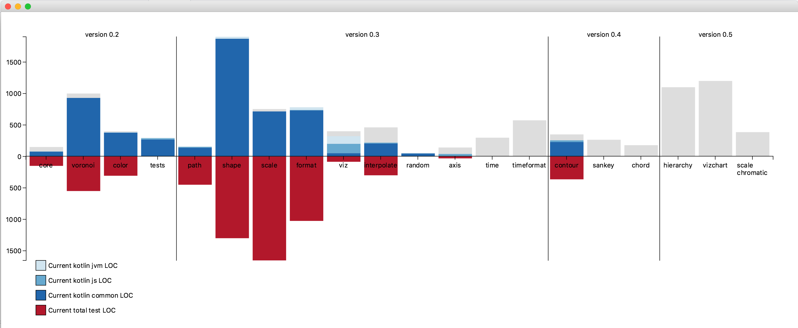

 This directory holds examples on how you can use data2viz.

## [Natural Log Scale](ex-natural-logscale)

- Common Plot, deployed inside JavaFx and Js
- LogScale, ContinuousScale.
- Path 

## [D2v progression stack](ex-progression-stack)

- Band Scale, ContinuousScale.
- Stack

