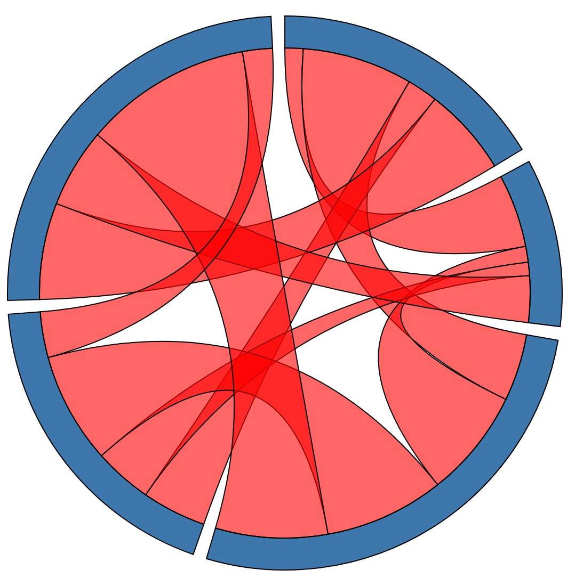
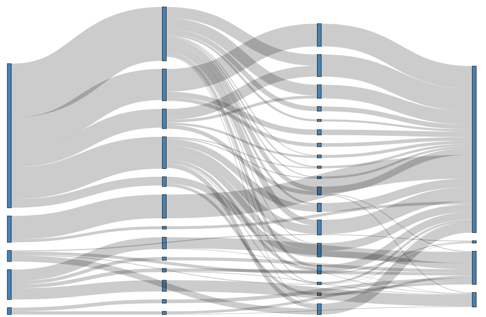

 This directory holds examples on how you can use data2viz.

## [Natural Log Scale](ex-natural-logscale)

- Common Plot, deployed inside JavaFx and Js
- LogScale, ContinuousScale.
- Path 

<a target="_blank" href="https://data2viz.github.io/data2viz/ex-natural-logscale-js/index.html" >
Open online js version.
</a>

[See code](ex-natural-logscale)

## [D2v progression stack](ex-progression-stack)

- Band Scale, ContinuousScale.
- Stack

<a target="_blank" href="https://data2viz.github.io/data2viz/ex-progression-stack-js/index.html" >
Open online js version.
</a>

[See code](ex-progression-stack)

## [Stream Graph](ex-streamGraph)

- Stack,
- Curves, stream grapth

<a target="_blank" href="https://data2viz.github.io/data2viz/ex-streamGraph-js/index.html" >
Open online js version.
</a>

[See code](ex-streamGraph)

## [Chord Graph](ex-chord)

- Chord diagram,
- Arcs, Path

<a target="_blank" href="https://data2viz.github.io/data2viz/ex-chord-js/index.html" >
Open online js version.
</a>

[See code](ex-chord)

## [Sankey Diagram](ex-sankey)

- Sankey layout,
- Links (path between nodes)

<a target="_blank" href="https://data2viz.github.io/data2viz/ex-sankey-js/index.html" >
Open online js version.
</a>

[See code](ex-sankey)

