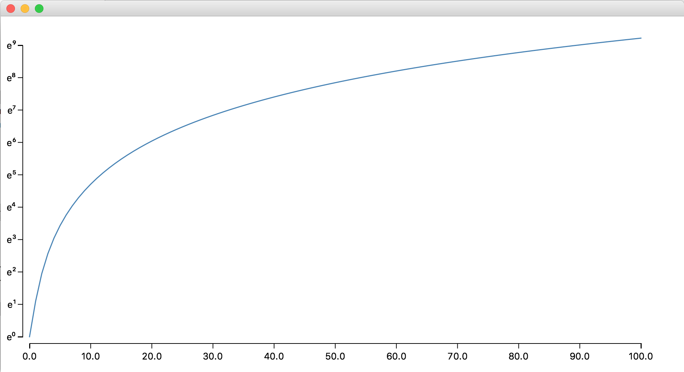

This example shows how to plot a mathematical function. It uses axis and scales 
(linear scale and log scale).

This version is multiplatform: the viz code is written in a common module
and then is just rendered in JavaFx or Js SVG element.



Here is the visualization code of the visual part: [<>](https://github.com/data2viz/data2viz/blob/master/examples/ex-natural-logscale/ex-natural-logscale-common/src/main/kotlin/NaturalLogScale.kt)

```kotlin
    group {
        transform {
            translate(x = -10.0)
        }
        axis(Orient.LEFT, y) {
            //we use our own formatter in order to provide exponents (ex: e¹)
            tickFormat = { "e${superscript[round(ln(it)).toInt()]}" }
        }
    }

    group {
        transform {
            translate(y = height + 10.0)
        }
        //default axis. Labels are provided by the x scale. 
        axis(Orient.BOTTOM, x)
    }

    group {
        path { //the curve is rendered with a path.
            fill = null
            stroke = colors.steelblue
            strokeWidth = 1.5

            moveTo(x(points[0].x), y(points[0].y))
            (1..100).forEach {
                lineTo(x(points[it].x), y(points[it].y))
            }
        }
    }

```

It's the possible to bootstrap this code inside the DOM :[<>](https://github.com/data2viz/data2viz/blob/master/examples/ex-natural-logscale/ex-natural-logscale-js/src/main/kotlin/NaturalLogScaleJs.kt)

```kotlin
fun main(args: Array<String>) {
    
    val svgElement = selectOrCreateSvg().apply {
        setAttribute("width", "${width + margins.hMargins}")
        setAttribute("height", "${height + margins.vMargins}")
    }

    svgElement.viz {
        naturalLogScale()
    }
}
```

or in a Java FX application: [<>](https://github.com/data2viz/data2viz/blob/master/examples/ex-natural-logscale/ex-natural-logscale-jvm/src/main/kotlin/NaturalLogScaleJvm.kt)

```kotlin
    override fun start(primaryStage: Stage?) {
        val root = Group()

        root.viz {
            naturalLogScale()
        }

        primaryStage?.let {
            it.scene = (Scene(root, width + margins.hMargins, height + margins.vMargins))
            it.show()
        }
    }
```

This example is a port of this [D3js example](https://bl.ocks.org/mbostock/7621155) 
in data2viz.
