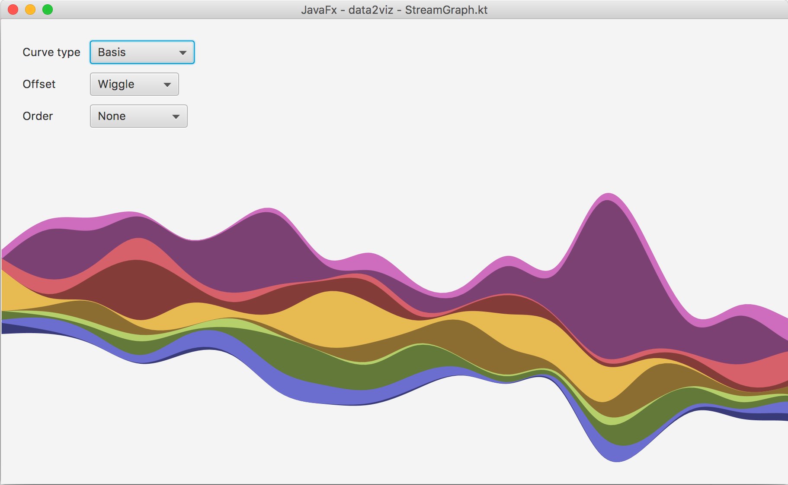

This example displays a simple stream graph.

data are presented using a *stacked line chart*.

On both js and jfx implementation it's possible to change some
configuration parameters (curve, offset, order) to see how it 
modifies the rendered chart.

