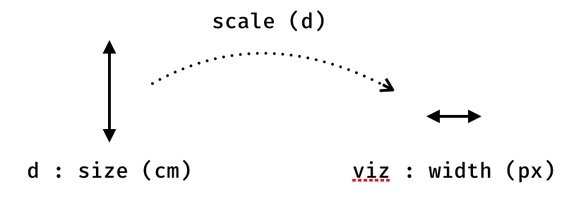

Scale is about the mapping of a dimension of a domain object (input) to a visual representation
(output).

The most simple example you can think of is the mapping of a real dimension (for example the 
size of the population) to a dimension inside the visualization (for example a height in pixels).

Scales play a enormous role in dataviz. 

Some definitions

**Quantitative** : represented by an number.

**Continuous**: when the dimension can take all the values between a range. 
Ex: a size between 0 m and 2 m.
 
**Discrete** : limited number of values without meaning between those values (Ex:
Sunday, Monday, Tuesday, Wednesday, Thursday, Friday, Saturday)

In scales, both inputs and outputs can be continuous or discrete.

domain contains the bounds of the interval that is going to be transformed.

Typically, this is two numbers. If this is more, we are talking about a 
polypoint scale: there are as many segments in the intervals as there are
numbers in the domain (minus one). The range must have as many numbers, 
and so as many segments. When using the scale, if a number is in the n-th
segment of the domain, it is transformed into a number in the n-th segment
of the range.   
   
Also, bounds of domain and range need not be numbers, as long as they can 
be converted to numbers. One useful examples are colors. Color names can be 
used as range, for instance, to create color ramps:

var ramp=d3.scale.linear().domain([0,100]).range(["red","blue"]);

This will transform any value betwen 0 and 100 into the corresponding color 
between red and blue.

## Clamping

What happends if the scale is asked to process a number outside of the domain? 
That’s what clamping controls. If it is set, then the bounds of the range are 
the minimum and maximum value that can be returned by the scale. Else, the 
same transformation applies to all numbers, whether they fall within the 
domain or not.

More often than not, the bounds of the domain and/or those of the ranges 
will be calculated. So, chances are they won’t be round numbers, or numbers 
a human would like. Scales, however, come with a bunch of method to address 
that. d3 keeps in mind that scales are often used to position marks along 
an axis.

var data=[-2.347, 4, 5.23,-1.234,6.234,7.431]; // or whatever.
var y=d3.scale.linear().range([0,120]);
y.domain([d3.min(data), d3.max(data)]); // domain takes bounds as arguments, not all numbers
y.domain() // [-2.347, 7.431];
y.nice() // [-3, 8]

## Continuous and discrete dimensions

### Quantize
Quantize works with a discrete range: in other terms, the output of quantize 
can only take a certain number of values.

continuous -> discrete

For instance:

### Quantile

Quantile on the other hand matches values in the domain (which, this time, 
is the full dataset) with their respective quantile. The number of quantiles 
is specified by the range.

discrete -> discrete

### Ordinal

discrete -> continuous

